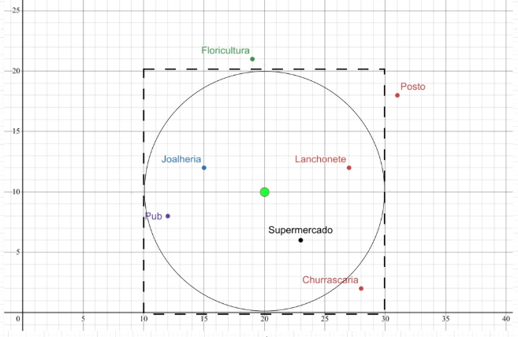

# Points Of Interest

Desafio pode ser acessado no [GitHub](https://github.com/backend-br/desafios/blob/master/points-of-interest/PROBLEM.md)

O desafio visa implementar um serviço para a empresa XY Inc., especializada na produção de excelentes receptores GPS (Global Positioning System). A diretoria está empenhada em lançar um dispositivo inovador que promete auxiliar pessoas na localização de pontos de interesse (POIs), e precisa muito de sua ajuda. Você foi contratado para desenvolver a plataforma que fornecerá toda a inteligência ao dispositivo. Esta plataforma deve ser baseada em serviços REST, para flexibilizar a integração.

O sistema é inicializado com os seguinte pontos de interesse:
- Lanchonete(x=27, y=12)
- Posto(x=31, y=18)
- Joalheria(x=15, y=12)
- Floricultura(x=19, y=21)
- Pub(x=12, y=8)
- Supermercado(x=23, y=6)
- Churrascaria(x=28, y=2)

## Tecnologias
- Spring Boot
- Banco H2


## Teste da aplicação

Dado o ponto de referência (x=20, y=10) indicado pelo receptor GPS, e uma distância máxima de 10 metros, o serviço deve retornar os seguintes POIs:



- Lanchonete
- Joalheria
- Pub
- Supermercado

## Endpoints
- Criar POI
```bash
curl --request POST \
  --url http://localhost:8080/points-of-interests \
  --header 'Content-Type: application/json' \
  --header 'User-Agent: insomnia/10.0.0' \
  --data '{
	"name": "Início",
	"x": 0,
	"y": 0
}'
```

- Listar todos POI
```bash
curl --request GET \
  --url http://localhost:8080/points-of-interests \
  --header 'User-Agent: insomnia/10.0.0'
```

- POI próximos
```bash
curl --request GET \
  --url 'http://localhost:8080/near-me?x=20&y=10&dmax=10' \
  --header 'User-Agent: insomnia/10.0.0'
```

